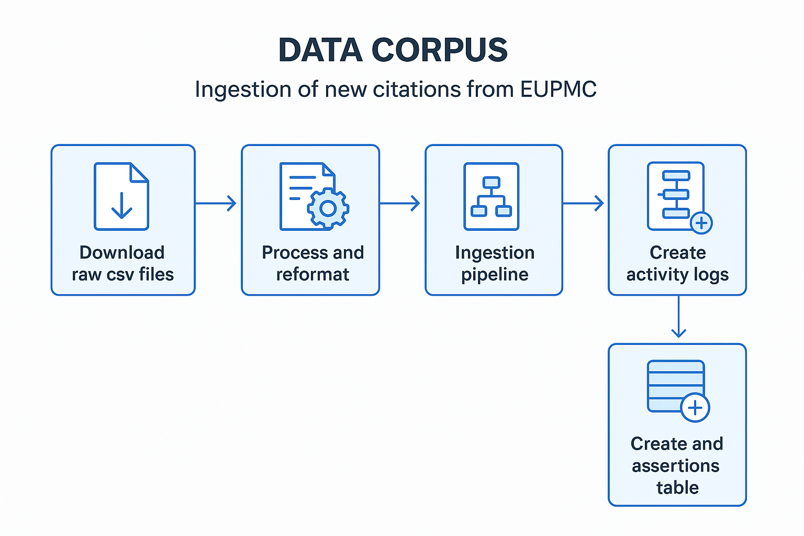

# EuropePMC v4 Ingestion – Release Documentation

## 1. Purpose of the Release
- **Goal:** Ingest new citations from EuropePMC (v4).
- **Outcome:** Expanded citation coverage and updated assertions table.

---

## 2. High-Level Workflow
1. **Download raw CSV files** from EuropePMC.
2. **Process and reformat** files by adding additional metadata.
3. **Store files in S3** in the correct path structure.
4. **Run ingestion pipeline:**
   - Reads S3 files
   - Creates activity logs
   - Processes activity logs
     - Run local apis for Crossref and ROR to mitigate rate limit
5. **Enrich data:**
   - DataCite (for DOIs)
   - Crossref (for accession numbers)
6. **Insert records into `assertions` table.**
7. **Post-processing cleanup** of malformed or duplicate records.
8. **Generate final data dump** for release.

---

## 3. Key Scripts and Commands
- `https://github.com/Make-Data-Count-Community/corpus-data-file/corpus-v4/data_ingestion/eupmc_reformat_csv.py`
- `https://github.com/Make-Data-Count-Community/corpus-data-file/corpus-v4/data_ingestion/eupmc_file_downloader.sh`

---

## 4. Gotchas / Lessons Learned
- Verify CSV schema changes before reformatting.
- Ensure correct S3 bucket and path to avoid ingestion failures.
- Monitor long-running pipeline jobs.
- Crossref enrichment may fail if DOI rate limits are hit.

---

## 5. Links to Artifacts
- **Raw CSV files (S3):** `s3://europepmc-files/unprocessed/`
- **Processed CSV files (S3):** `s3://europepmc-files/processed/`
- **V4 dump files (S3):** `s3://corpus-data-files/v4.1/`

---
